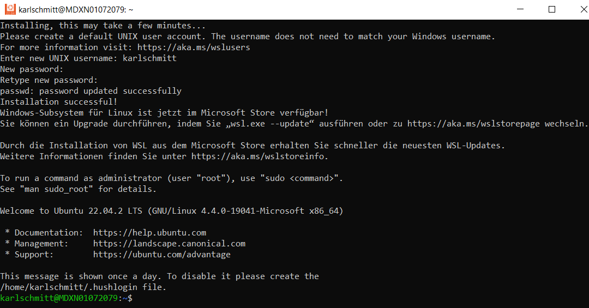

# TypeScriptCodingDojo
This code repository aims to provide a solid introduction
to JavaScript and TypeScript including Test-Driven-Development using Unit-Testing.

## Background

1. This document is written in Markdown language, to learn more about Markdown: [Markdown Cheat Sheet](https://www.markdownguide.org/cheat-sheet/)
2. Visual Studio Code can be used to edit you code: [Visual Studio Code](https://code.visualstudio.com/)
3. The runtime for Angular is Node JS, a portable zip version can be found here: [Node JS Zip](https://nodejs.org/en/download/current)
4. JavaScript for absolute Beginers: [JavaScript One](https://www.learn-js.org/)
5. Good Overview of JavaScript Tutorials: [Overview](https://www.freecodecamp.org/news/learn-javascript-free-js-courses-for-beginners/)
6. TypeScript is documented here: [TypeScript](https://www.typescriptlang.org/)
7. A TypeScript tutorial can be found here: [TypeScript Tutorial](https://www.typescripttutorial.net/)
8. A very nice short hand documentation of TypeScript: [Cheet Sheets](https://www.typescriptlang.org/cheatsheets)
9. Web Development: [The odin project](https://www.theodinproject.com/)
10. Learn Web-Development including JavaScript [Web-Development](https://developer.mozilla.org/en-US/docs/Web/Tutorials)
11. Nice introduction to Unit-Testing: [Unit-Testing One](https://www.testim.io/blog/typescript-unit-testing-101/)
12. Unnderstanding Unit-Testing: [Unit-Testing Two](https://chiragrupani.medium.com/writing-unit-tests-in-typescript-d4719b8a0a40)
13. Behavior-Driven JavaScript: [Jasmine](https://jasmine.github.io/)
14. Jason Server: [jason-server](https://www.npmjs.com/package/json-server#simple-example)
15. Learning Visual Studio Code: [Visual Studiio Code](https://code.visualstudio.com/docs/nodejs/nodejs-tutorial)

## Emotions

Emoticons are listed here :grinning: [emojies](https://gist.github.com/roachhd/1f029bd4b50b8a524f3c)

## GitBash

Git for Windows can be downloaded here: [GitBash for Windows](https://gitforwindows.org/)

**_NOTE:_** You might need admin rights though, so feel free use the next Web link!

Also feel free to download the portable version: [GitBash portable](https://git-scm.com/download/win)

## Visual Studio Code a powerful code editor

Visual Studio Code can be dowloaded here: [Visual Studio Code](https://code.visualstudio.com/download)

## NodeJs "Auf den Schultern von Risen stehen"

NodeJs can be downloaded here zip or tar.gz archive: [NodeJS distributions](https://nodejs.org/dist/)

1. First, download and extract the archive into a folder of your choice
2. Second, add the folder to your **path** variable, on Windows this is "Umgebungsvariablen für dieses Konto bearbeiten"

## JavaScript to learn list

1. The absoulte beginning: [JavaScript One](https://learn.microsoft.com/de-de/shows/beginners-series-to-javascript/?wt.mc_id=javascript-29163-cxa)

## TypeScript to learn list

1. TypeScript closures explained: [Closures](https://o7planning.org/14063/typescript-closures)

## Linux on Windows

When starting with Linux in any form you might consider to become acquainted with the vi editor: [vim](https://github.com/iggredible/Learn-Vim)

This section provides some hints on how to install a virtual Linux on your Windows machine :relaxed: 

First list the available Linux distributions:
```
wsl --list --online
```
Second install the desired distrobution:
```
wsl --install -d <DistroName>
```
In the time writing this tutorial ist was Ubuntu 22
```
wsl --install -d Ubuntu-22.04
```
Please feel free to choose a newer Ubuntu version available :smirk:





In case you need to get rid of your WSL Linux you can use the following command:
```
wsl --unregister Ubuntu
```

Let's update our new Linux, this is always a good idea:
```
sudo apt-get update
```
Next let us navigate into the temp folder and download the NodeJs tar ball:
```
cd /tmp
```
```
wget https://nodejs.org/download/release/latest-v21.x/node-v21.0.0-linux-x64.tar.gz
````
Now let us install the freshly provided NodeJs tar ball:
```
sudo tar -C /usr/local --strip-components 1 -xzf node-v21.0.0-linux-x64.tar.gz
```
Finaly let's check the node and npm versions:
```
node -v
```
```
npm -v
```

Finaly let's install the simple-server package:
```
npm install -g json-server
```
And start playing:

1. [Getting started](https://www.npmjs.com/package/json-server#getting-started)
2. [Simple server](https://www.npmjs.com/package/json-server#simple-example)


